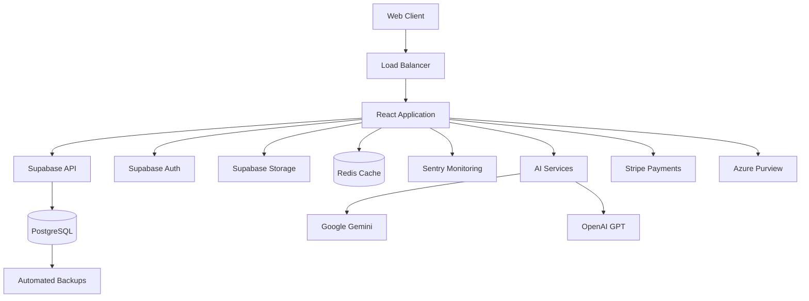

# AuditReady Platform Architecture

## Overview

AuditReady is an enterprise-grade compliance management platform built with modern web technologies and designed for scalability, security, and maintainability. This document outlines the architectural decisions, patterns, and best practices that define the platform.

---

## 🏗️ High-Level Architecture



---

## 📁 Project Structure

### Frontend Architecture
```
src/
├── components/           # Reusable UI components
│   ├── ui/              # Base UI components (shadcn/ui)
│   ├── admin/           # Admin-specific components
│   ├── compliance/      # Compliance domain components
│   ├── assessments/     # Assessment workflow components
│   ├── documents/       # Document management components
│   ├── LMS/             # Learning Management System
│   ├── settings/        # Configuration components
│   └── ...              # Domain-specific folders
├── pages/               # Route-level page components
├── services/            # Business logic layer
├── stores/              # Global state management
├── hooks/               # Custom React hooks
├── lib/                 # Utilities and configurations
├── types/               # TypeScript type definitions
└── utils/               # Helper functions
```

### Service Layer Architecture
```
src/services/
├── ai/                  # AI service orchestration
│   ├── GeminiContentGenerator.ts
│   ├── MermaidAIService.ts
│   └── QualityValidator.ts
├── admin/               # Platform administration
│   ├── AdminService.ts
│   └── AuditLogger.ts
├── compliance/          # Framework management
│   ├── ComplianceUnificationService.ts
│   └── FrameworkMappingService.ts
├── security/            # Security services
│   ├── SecurityService.ts
│   └── DataEncryption.ts
├── backup/              # Data backup & recovery
└── classification/      # Data classification
```

---

## 🎯 Architectural Principles

### 1. Component-First Architecture
**Principle**: Break down complex functionality into reusable, testable components

**Implementation**:
- Maximum 500-line file size limit for AI-friendly development
- Unified component patterns (`Unified*`, `Enhanced*` naming)
- Consistent prop interfaces across similar components
- Single responsibility principle for all components

**Example Pattern**:
```typescript
// Before: 1,800-line monolithic file
// After: Extracted components
├── UnifiedDashboardHeader.tsx     (120 lines)
├── UnifiedStatsGrid.tsx          (180 lines)
├── UnifiedKnowledgePanel.tsx     (200 lines)
└── UnifiedCategoryManager.tsx    (150 lines)
```

### 2. Service Layer Separation
**Principle**: Isolate business logic from UI components

**Implementation**:
```typescript
// Clean separation of concerns
class ComplianceService {
  async getFrameworks(): Promise<Framework[]>
  async validateRequirements(data: ValidationData): Promise<ValidationResult>
  async generateGuidance(context: GuidanceContext): Promise<Guidance>
}

// Component uses service
const ComplianceComponent = () => {
  const { data } = useQuery({
    queryKey: ['frameworks'],
    queryFn: ComplianceService.getFrameworks
  });
};
```

### 3. Type-Driven Development
**Principle**: Comprehensive TypeScript typing for reliability

**Implementation**:
```typescript
// Strict typing across all layers
interface AssessmentRequirement {
  id: string;
  title: string;
  description: string;
  category: ComplianceCategory;
  frameworks: FrameworkMapping[];
  evidence: EvidenceRequirement[];
  validation: ValidationRule[];
}

// Service contracts
interface IComplianceService {
  validateRequirement(req: AssessmentRequirement): Promise<ValidationResult>;
  generateEvidence(req: AssessmentRequirement): Promise<Evidence[]>;
}
```

---

## 🔐 Security Architecture

### Defense in Depth Implementation

#### 1. Authentication & Authorization
```typescript
// Multi-layer auth system
├── Supabase Auth (SSO + local)
├── Microsoft Entra ID integration
├── Multi-Factor Authentication (TOTP + backup codes)
├── Row-Level Security (RLS) policies
└── Role-Based Access Control (RBAC)
```

#### 2. Data Protection
```typescript
// Comprehensive data security
├── Encryption at rest (Supabase)
├── Encryption in transit (TLS 1.3)
├── Input validation (Zod schemas)
├── XSS protection (DOMPurify)
├── SQL injection prevention (parameterized queries)
└── CSRF protection (tokens)
```

#### 3. Security Headers
```typescript
// Content Security Policy implementation
const securityHeaders = {
  'Content-Security-Policy': "default-src 'self'; script-src 'self' 'unsafe-inline'",
  'X-Frame-Options': 'DENY',
  'X-Content-Type-Options': 'nosniff',
  'Referrer-Policy': 'strict-origin-when-cross-origin',
  'Strict-Transport-Security': 'max-age=31536000; includeSubDomains'
};
```

### OWASP Top 10 Compliance Matrix

| OWASP Risk | Implementation | Status |
|------------|---------------|--------|
| A01 - Broken Access Control | RLS + RBAC + MFA | ✅ Complete |
| A02 - Cryptographic Failures | TLS 1.3 + AES-256 | ✅ Complete |
| A03 - Injection | Parameterized queries + Zod | ✅ Complete |
| A04 - Insecure Design | Security by design | ✅ Complete |
| A05 - Security Misconfiguration | Security headers + CSP | ✅ Complete |
| A06 - Vulnerable Components | Automated scanning | ✅ Complete |
| A07 - Authentication Failures | MFA + SSO + lockout | ✅ Complete |
| A08 - Software Integrity | Subresource integrity | ✅ Complete |
| A09 - Logging Failures | Comprehensive audit logs | ✅ Complete |
| A10 - Server-Side Request Forgery | Input validation + allowlists | ✅ Complete |

---

## 📊 Data Architecture

### Database Design

#### Core Tables Structure
```sql
-- Organization hierarchy with RLS
organizations (tenant isolation)
├── users (RBAC integration)
├── assessments (compliance workflows)
├── requirements (framework mapping)
├── standards (framework definitions)
├── documents (evidence management)
├── risks (risk management)
└── audit_logs (compliance tracking)
```

#### Multi-Tenant Isolation
```sql
-- Row-Level Security implementation
CREATE POLICY "Users can only access their organization data"
  ON assessments FOR ALL
  USING (organization_id = auth.organization_id());

-- Automatic tenant context
CREATE OR REPLACE FUNCTION auth.organization_id()
RETURNS uuid AS $$
  SELECT organization_id FROM users 
  WHERE id = auth.uid()
$$ LANGUAGE sql STABLE;
```

#### Data Classification System
```typescript
interface DataClassification {
  id: string;
  label: string;           // Public, Internal, Confidential, Restricted
  retention_policy: string; // GDPR/CCPA compliance
  access_controls: AccessRule[];
  encryption_required: boolean;
  geographic_restrictions?: string[];
}
```

---

## 🚀 Performance Architecture

### Bundle Optimization Strategy

#### Code Splitting Implementation
```typescript
// Route-level splitting
const Dashboard = lazy(() => import('./pages/Dashboard'));
const Assessments = lazy(() => import('./pages/Assessments'));
const ComplianceSimplification = lazy(() => 
  import('./pages/ComplianceSimplification')
);

// Component-level splitting for large features
const EnhancedAREditor = lazy(() => 
  import('./components/editor/EnterpriseAREditor')
);
```

#### File Size Management
```typescript
// Enforced file size limits
const FILE_SIZE_RULES = {
  WARNING_THRESHOLD: 400,  // lines
  CRITICAL_THRESHOLD: 450, // lines  
  MAXIMUM_ALLOWED: 500,    // lines (hard limit)
};

// Automated extraction patterns
interface ComponentExtractionStrategy {
  target: 'ui-components' | 'business-logic' | 'type-definitions';
  destination: string;
  naming_convention: 'Unified*' | 'Enhanced*' | 'Shared*';
}
```

### Caching Strategy
```typescript
// Multi-layer caching approach
├── React Query (client-side)
├── Redis (server-side)
├── Browser Cache (static assets)
└── CDN (global distribution)

// Cache invalidation strategy
const cacheKeys = {
  assessments: (orgId: string) => `assessments:${orgId}`,
  frameworks: () => 'frameworks:all',
  user: (userId: string) => `user:${userId}`,
};
```

---

## 🤖 AI Integration Architecture

### AI Service Orchestration
```typescript
interface AIServiceProvider {
  name: 'gemini' | 'openai' | 'anthropic';
  capabilities: AICapability[];
  rateLimits: RateLimit;
  fallbackProvider?: AIServiceProvider;
}

class AIOrchestrator {
  async generateContent(prompt: string, context: Context): Promise<Content> {
    const provider = this.selectOptimalProvider(prompt, context);
    return provider.generate(prompt, context);
  }
}
```

### AI-Powered Features
```typescript
// Compliance guidance generation
├── Framework mapping suggestions
├── Evidence requirement analysis  
├── Risk assessment automation
├── Document template generation
└── Real-time compliance monitoring
```

---

## 🔄 State Management Architecture

### Zustand Store Pattern
```typescript
// Domain-specific stores
interface ComplianceStore {
  // State
  frameworks: Framework[];
  selectedFrameworks: string[];
  requirements: Requirement[];
  
  // Actions
  loadFrameworks: () => Promise<void>;
  selectFramework: (id: string) => void;
  validateRequirements: () => Promise<ValidationResult>;
}

// Store composition
const useAppStore = create<AppStore>((set, get) => ({
  ...useComplianceStore.getState(),
  ...useAssessmentStore.getState(),
  ...useAuthStore.getState(),
}));
```

### Real-time Data Synchronization
```typescript
// Supabase Realtime integration
const subscription = supabase
  .channel('assessments')
  .on('postgres_changes', {
    event: '*',
    schema: 'public',
    table: 'assessments',
    filter: `organization_id=eq.${organizationId}`
  }, (payload) => {
    // Update local state
    updateAssessmentStore(payload);
  })
  .subscribe();
```

---

## 🐳 Deployment Architecture

### Container Strategy
```dockerfile
# Multi-stage production build
FROM node:18-alpine AS builder
WORKDIR /app
COPY package*.json ./
RUN npm ci --only=production

FROM nginx:alpine AS production
COPY --from=builder /app/dist /usr/share/nginx/html
COPY nginx.conf /etc/nginx/nginx.conf
```

### Kubernetes Deployment
```yaml
# Production deployment structure
├── base/                    # Common configuration
│   ├── deployment.yaml     # Application deployment
│   ├── service.yaml        # Load balancer service
│   ├── ingress.yaml        # Traffic routing
│   └── configmap.yaml      # Environment variables
├── overlays/
│   ├── development/        # Dev environment overrides
│   ├── staging/           # Staging environment overrides
│   └── production/        # Production environment overrides
```

### Infrastructure as Code
```terraform
# Terraform infrastructure management
resource "kubernetes_deployment" "auditready" {
  metadata {
    name = "auditready-app"
    labels = {
      app = "auditready"
      version = var.app_version
    }
  }
  
  spec {
    replicas = var.replica_count
    
    template {
      spec {
        container {
          name  = "app"
          image = "auditready:${var.app_version}"
          
          resources {
            requests = {
              cpu    = "100m"
              memory = "128Mi"
            }
            limits = {
              cpu    = "500m"
              memory = "512Mi"
            }
          }
        }
      }
    }
  }
}
```

---

## 📈 Monitoring & Observability

### Application Monitoring
```typescript
// Sentry integration for error tracking
import * as Sentry from '@sentry/browser';

Sentry.init({
  dsn: process.env.VITE_SENTRY_DSN,
  integrations: [
    new Sentry.BrowserTracing(),
  ],
  tracesSampleRate: 1.0,
  environment: process.env.NODE_ENV,
});

// Performance monitoring
const performanceMetrics = {
  bundleSize: '2.8MB → 2.0MB target',
  firstLoadTime: '3.2s → 2.5s target',
  lighthouseScore: '85 → 95+ target',
};
```

### Infrastructure Monitoring
```yaml
# Prometheus + Grafana stack
apiVersion: v1
kind: ConfigMap
metadata:
  name: prometheus-config
data:
  prometheus.yml: |
    global:
      scrape_interval: 15s
    scrape_configs:
      - job_name: 'auditready'
        static_configs:
          - targets: ['auditready-service:3000']
```

---

## 🔧 Development Workflow

### File Size Enforcement
```typescript
// Pre-commit hook for file size validation
const FILE_SIZE_CHECKER = {
  maxLines: 500,
  warningThreshold: 400,
  exemptFiles: [
    'src/data/mockData.ts',        // Demo data
    'src/types/generated.ts',      // Generated types
  ],
  
  check: (files: string[]) => {
    return files.filter(file => getLineCount(file) > FILE_SIZE_CHECKER.maxLines);
  }
};
```

### Component Extraction Workflow
```typescript
// Systematic extraction process
interface ExtractionPlan {
  sourceFile: string;
  targetComponents: ComponentDefinition[];
  sharedInterfaces: TypeDefinition[];
  testStrategy: TestingApproach;
}

const extractionWorkflow = {
  1: 'Identify extraction candidates',
  2: 'Plan component boundaries',
  3: 'Extract with tests',
  4: 'Validate functionality',
  5: 'Update imports and exports',
  6: 'Performance verification'
};
```

---

## 🎯 Architecture Goals & Metrics

### Performance Targets
- **Bundle Size**: <2MB initial load
- **Core Web Vitals**: LCP <2.5s, FID <100ms, CLS <0.1
- **File Size Compliance**: 100% files under 500 lines
- **TypeScript Errors**: Zero errors in production

### Scalability Targets
- **Concurrent Users**: 10,000+ per instance
- **Data Volume**: 1TB+ per tenant
- **API Response Time**: <200ms for 95% of requests
- **Database Connections**: Efficient connection pooling

### Security Targets
- **OWASP Compliance**: 100% Top 10 coverage
- **Audit Compliance**: SOC 2 Type II ready
- **Data Protection**: GDPR/CCPA compliant
- **Penetration Testing**: Quarterly security audits

---

## 🔮 Future Architecture Considerations

### Microservices Evolution
```typescript
// Future service decomposition
├── Authentication Service
├── Compliance Engine Service  
├── Document Processing Service
├── AI/ML Service
├── Notification Service
└── Analytics Service
```

### Edge Computing Strategy
- AI inference at the edge for real-time guidance
- Regional data residency compliance
- CDN integration for global performance

### Advanced AI Integration
- Custom fine-tuned models for compliance
- Real-time natural language processing
- Automated evidence collection and analysis

---

This architecture document serves as the foundation for understanding how AuditReady is built and how it can be extended. It emphasizes maintainability, security, and performance while providing clear patterns for future development.

---

*Architecture Version: 2.0 | Last Updated: September 27, 2025 | Next Review: December 2025*