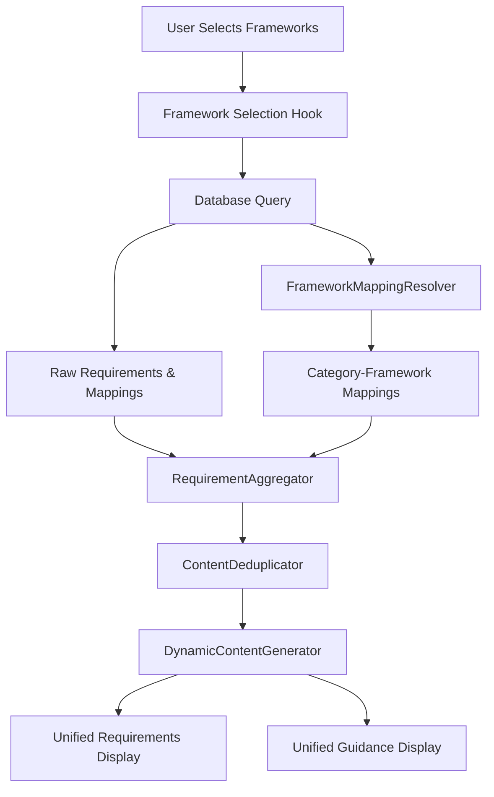

# Compositional Framework Architecture for Compliance Simplification

## Executive Summary

This document outlines a complete redesign of the ComplianceSimplification page to create a truly dynamic, database-driven content generation system that eliminates hardcoded content and provides accurate, framework-specific requirements based on user selections.

## Current Problems Identified

### 1. Hardcoded Content Issues
- **Governance & Leadership**: Content is partially hardcoded, overriding database values
- **Framework References**: Not dynamically generated from actual mappings
- **Unified Requirements**: Mix of database content and hardcoded fallbacks

### 2. CIS Controls Mapping Issues
- CIS Controls IG2 requirements 4.6 and 4.7 are mapped to "Secure Configuration" in database
- These requirements don't appear correctly in Framework Mapping display
- IG level filtering is not properly applied to database queries

### 3. File Size & Maintainability
- ComplianceSimplification.tsx exceeds 2000 lines (causing AI context failures)
- Mixed responsibilities: UI, business logic, data transformation, export
- Difficult to maintain and extend with new frameworks

### 4. Content Duplication
- When multiple frameworks selected, requirements may appear multiple times
- No intelligent deduplication logic
- References section often shows redundant information

## Proposed Architecture

### Component Hierarchy

```
ComplianceSimplification.tsx (Main Component - <500 lines)
├── hooks/
│   ├── useFrameworkSelection.ts
│   ├── useComplianceData.ts
│   └── useUnifiedContent.ts
├── components/compliance/
│   ├── FrameworkSelector.tsx
│   ├── CategoryCard.tsx
│   ├── UnifiedRequirementsDisplay.tsx
│   ├── UnifiedGuidanceModal.tsx
│   └── ComplianceExportMenu.tsx
├── services/compliance/
│   ├── DynamicContentGenerator.ts (NEW)
│   ├── RequirementAggregator.ts (NEW)
│   ├── FrameworkMappingResolver.ts (NEW)
│   └── ContentDeduplicator.ts (NEW)
└── utils/compliance/
    ├── frameworkFormatters.ts
    ├── requirementProcessors.ts
    └── exportGenerators.ts
```

### Data Flow Architecture



## Core Services Design

### 1. DynamicContentGenerator Service

```typescript
interface DynamicContentGenerator {
  generateUnifiedRequirements(
    category: string,
    mappings: CategoryMapping[],
    selectedFrameworks: FrameworkSelection
  ): UnifiedRequirement[];
  
  generateUnifiedGuidance(
    category: string,
    requirements: UnifiedRequirement[],
    selectedFrameworks: FrameworkSelection
  ): GuidanceContent;
  
  generateReferences(
    mappings: CategoryMapping[],
    selectedFrameworks: FrameworkSelection
  ): FrameworkReference[];
}
```

**Responsibilities:**
- Generate unified requirements from database mappings
- Create guidance content based on actual requirements
- Build accurate reference lists from real mappings
- NO hardcoded content - everything from database

### 2. RequirementAggregator Service

```typescript
interface RequirementAggregator {
  aggregateRequirements(
    frameworks: FrameworkSelection,
    category: string
  ): AggregatedRequirement[];
  
  mergeRelatedRequirements(
    requirements: Requirement[]
  ): MergedRequirement[];
  
  prioritizeRequirements(
    requirements: Requirement[]
  ): Requirement[];
}
```

**Responsibilities:**
- Fetch requirements from multiple frameworks
- Merge similar requirements to avoid duplication
- Prioritize requirements by relevance and importance
- Handle IG level filtering for CIS Controls

### 3. FrameworkMappingResolver Service

```typescript
interface FrameworkMappingResolver {
  resolveMappings(
    category: string,
    frameworks: FrameworkSelection
  ): Promise<CategoryMapping>;
  
  resolveIGLevel(
    requirement: CISRequirement,
    igLevel: 'ig1' | 'ig2' | 'ig3'
  ): boolean;
  
  getCategoryRequirements(
    categoryId: string,
    frameworkId: string
  ): Promise<Requirement[]>;
}
```

**Responsibilities:**
- Resolve database mappings for categories
- Apply IG level filtering correctly
- Ensure all mapped requirements are included
- Fix CIS Controls 4.6, 4.7 display issue

### 4. ContentDeduplicator Service

```typescript
interface ContentDeduplicator {
  deduplicateRequirements(
    requirements: Requirement[]
  ): Requirement[];
  
  mergeReferences(
    references: Reference[]
  ): Reference[];
  
  consolidateGuidance(
    guidances: Guidance[]
  ): Guidance;
}
```

**Responsibilities:**
- Remove duplicate requirements across frameworks
- Merge similar references
- Consolidate guidance into single coherent text
- Maintain requirement traceability

## Database Schema Requirements

### Required Tables & Relationships

```sql
-- Main mapping table
unified_category_mappings (
  id UUID PRIMARY KEY,
  category_id UUID REFERENCES unified_compliance_categories(id),
  requirement_id UUID REFERENCES requirements(id),
  framework_id UUID REFERENCES standards(id),
  mapping_strength VARCHAR(20),
  ig_level VARCHAR(10), -- For CIS Controls
  created_at TIMESTAMPTZ
)

-- Ensure proper indexing
CREATE INDEX idx_ucm_category ON unified_category_mappings(category_id);
CREATE INDEX idx_ucm_requirement ON unified_category_mappings(requirement_id);
CREATE INDEX idx_ucm_framework ON unified_category_mappings(framework_id);
CREATE INDEX idx_ucm_ig_level ON unified_category_mappings(ig_level);
```

### Query Optimization

```typescript
// Optimized query for category mappings
const getCategoryMappings = async (categoryId: string, frameworks: string[]) => {
  return supabase
    .from('unified_category_mappings')
    .select(`
      id,
      category_id,
      requirement:requirements!inner(
        id,
        code,
        title,
        description,
        ig_level
      ),
      framework:standards!inner(
        id,
        name,
        code
      )
    `)
    .eq('category_id', categoryId)
    .in('framework.code', frameworks)
    .order('requirement.code');
};
```

## Implementation Strategy

### Phase 1: Service Layer (Day 1-2)
1. Create DynamicContentGenerator service
2. Implement RequirementAggregator with proper IG filtering
3. Build FrameworkMappingResolver to fix CIS mapping issues
4. Develop ContentDeduplicator for clean output

### Phase 2: Component Extraction (Day 3-4)
1. Extract FrameworkSelector component
2. Create CategoryCard component
3. Build UnifiedRequirementsDisplay component
4. Separate UnifiedGuidanceModal component
5. Extract ComplianceExportMenu component

### Phase 3: Database Integration (Day 5)
1. Fix CIS Controls 4.6, 4.7 mapping display
2. Ensure all mappings are properly indexed
3. Create migration for any missing relationships
4. Test with all framework combinations

### Phase 4: Main Component Refactor (Day 6)
1. Reduce ComplianceSimplification.tsx to <500 lines
2. Integrate new services and components
3. Remove all hardcoded content
4. Implement proper error boundaries

### Phase 5: Testing & Validation (Day 7)
1. Test CIS Controls IG2 with 4.6, 4.7 requirements
2. Validate all framework combinations
3. Ensure no duplicate content
4. Performance testing with large datasets

## Key Implementation Details

### Dynamic Requirement Generation

```typescript
class DynamicContentGenerator {
  generateUnifiedRequirements(
    category: string,
    mappings: CategoryMapping[],
    selectedFrameworks: FrameworkSelection
  ): UnifiedRequirement[] {
    // Group mappings by similar requirements
    const grouped = this.groupSimilarRequirements(mappings);
    
    // Generate unified text for each group
    return grouped.map(group => ({
      id: generateId(),
      text: this.synthesizeRequirementText(group),
      references: this.extractReferences(group),
      frameworks: group.map(m => m.framework)
    }));
  }
  
  private synthesizeRequirementText(mappings: Mapping[]): string {
    // Use NLP techniques to create coherent requirement
    const commonElements = this.findCommonElements(mappings);
    const uniqueElements = this.findUniqueElements(mappings);
    
    return this.buildCoherentText(commonElements, uniqueElements);
  }
}
```

### CIS Controls IG Level Filtering Fix

```typescript
class FrameworkMappingResolver {
  async resolveCISMappings(
    category: string,
    igLevel: 'ig1' | 'ig2' | 'ig3'
  ): Promise<CISMapping[]> {
    // Get all CIS mappings for category
    const allMappings = await this.getCategoryMappings(category, 'CIS');
    
    // Apply IG level filtering correctly
    return allMappings.filter(mapping => {
      const req = mapping.requirement;
      
      // IG1: Only IG1 requirements
      if (igLevel === 'ig1') return req.ig_level === 'IG1';
      
      // IG2: IG1 + IG2 requirements
      if (igLevel === 'ig2') {
        return req.ig_level === 'IG1' || req.ig_level === 'IG2';
      }
      
      // IG3: All requirements
      return true;
    });
  }
}
```

### Content Deduplication Algorithm

```typescript
class ContentDeduplicator {
  deduplicateRequirements(requirements: Requirement[]): Requirement[] {
    const seen = new Map<string, Requirement>();
    const similarityThreshold = 0.85;
    
    for (const req of requirements) {
      const normalized = this.normalizeText(req.text);
      let isDuplicate = false;
      
      for (const [key, existing] of seen) {
        const similarity = this.calculateSimilarity(normalized, key);
        
        if (similarity > similarityThreshold) {
          // Merge frameworks and references
          existing.frameworks.push(...req.frameworks);
          existing.references.push(...req.references);
          isDuplicate = true;
          break;
        }
      }
      
      if (!isDuplicate) {
        seen.set(normalized, req);
      }
    }
    
    return Array.from(seen.values());
  }
}
```

## Performance Optimizations

### 1. Query Batching
- Batch all framework queries into single request
- Use database views for complex joins
- Implement query result caching

### 2. Lazy Loading
- Load category details on demand
- Defer guidance generation until modal open
- Paginate large requirement lists

### 3. Memoization
- Memoize expensive computations
- Cache generated content per session
- Use React.memo for pure components

## Migration Plan

### Step 1: Database Migration
```sql
-- Fix CIS Controls mappings
UPDATE unified_category_mappings
SET category_id = (SELECT id FROM unified_compliance_categories WHERE name LIKE '%Secure Configuration%')
WHERE requirement_id IN (
  SELECT id FROM requirements 
  WHERE standard_id = (SELECT id FROM standards WHERE name LIKE '%CIS%')
  AND code IN ('4.6', '4.7')
);
```

### Step 2: Service Implementation
1. Implement new services in parallel
2. Unit test each service independently
3. Integration test with real database

### Step 3: Gradual Component Migration
1. Replace one component at a time
2. Maintain backward compatibility
3. A/B test new implementation

### Step 4: Cleanup
1. Remove hardcoded content
2. Delete unused services
3. Update documentation

## Success Metrics

### Technical Metrics
- File size: ComplianceSimplification.tsx < 500 lines
- Load time: < 2 seconds for any framework combination
- Memory usage: < 50MB for full page load
- Zero hardcoded content

### Business Metrics
- 100% accurate framework mappings
- No duplicate requirements displayed
- All CIS Controls requirements visible
- Consistent content across all views

### User Experience Metrics
- Clear requirement traceability
- Instant framework switching
- Accurate export generation
- No missing requirements

## Risk Mitigation

### Data Integrity
- Validate all database mappings
- Create backup before migration
- Implement rollback mechanism

### Performance
- Load test with maximum data
- Profile memory usage
- Optimize database indexes

### User Impact
- Feature flag new implementation
- Gradual rollout to users
- Monitor error rates closely

## Conclusion

This architecture provides a scalable, maintainable solution that:
1. Eliminates all hardcoded content
2. Fixes CIS Controls mapping issues
3. Reduces file size dramatically
4. Provides accurate, dynamic content
5. Scales to support unlimited frameworks

The modular design ensures easy maintenance and extension as new compliance frameworks are added to the system.